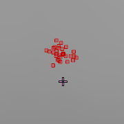

# CS:GO Spray Patterns (A Dissection)

CS:GO is one of the biggest esports out there, and also my personal favorite FPS game that was introduced to me by a friend, which got me in to PC gaming. The game has a very rich [history](https://www.youtube.com/watch?v=H8Nv--NOU2k) and despite very little marketing from Valve, it has stayed consistently as one of Steam's top games, it's influence mainly spreads through word of mouth from esports organizers, or its player base like how I was introduced to this game.

This my attempt in understanding Counter-Strike's gunplay of 20 years of refinement from the original Half-life mod.

<br>

# Spray Patterns

The stupidly ingenious way of simulating recoil in the early 2000s has been refined over the last two decades of many different iterations of the game. It has become it's own discipline where you have raw aimers such as Niko, ScreaM, or Twistzz, there are players that can conduct surgical mouse control on the game's recoil system with the likes of Elige, and Magisk.
Spray patterns are an example of *procedural generation*.

<br>

## What are spray patterns?

Spray patterns are a bunch of *fixed points used to offset a raycast*. A pattern is usually unique per weapon, and mimicking the pattern in reverse using mouse control simulates that weapon's recoil. (This is not how recoil in real life works, but it's a really genious game design for skill expression)

<br>

<div>
    
    
</div>

<div>
    
    
</div>

<br>

# Bullet Spread
Is the **Noise Offset** per bullet in a given spray pattern. This is the RNG factor of a spray, giving the recoil pattern some form of inconsistency, a pseudo-random noise, a game design to simulate weapon effectiveness in a given range. Think of how the hand cannon that is the Deagle has some sort of inaccuracy per shot (including the first shot). This is also the developer's way of balancing the game, what's stopping players like Niko from buying a Deagle every round and aim diff everyone in the server, or spray maestros like Elige from doing pixel perfect spray control, its because of **Bullet Spread**. **The Spread is not equal to Spray patterns**, it is the **_Noise Offset/RNG_** factor.

<br>

# Visualization
In order to visualize the mechanics of spray patterns and bullet spread, I'm going to boot CS:GO with [this workshop map](https://steamcommunity.com/sharedfiles/filedetails/?id=467786170), the grayscale theme is perfect for visualizing bullet impacts.

To visualize bullet impacts, toggle the developer console, and enable cheats by setting the [sv_cheats](https://totalcsgo.com/command/svcheats) flag. Next is by setting [sv_showimpacts](https://totalcsgo.com/command/svshowimpacts) the flag of 2, because of online multiplayer games following a client-server architecture, we only care about visualizing impacts from the client side. The gunplay system combines both spray patterns and bullet spread, in order to visualize the two, we can set [this flag](https://totalcsgo.com/command/weaponaccuracynospread) to true or false, effectively disabling the RNG.

The commands can be typed individually in the console or seperated by a semicolon indicating a statement like in C based languages.

```
sv_cheats 1; sv_showimpacts 2; weapon_accuracy_nospread 1;
```

<br>

 Here are some samples of the AK47 spray pattern, with and without bullet spread, controlled and uncontrolled recoil to the best of my efforts. The samples are gathered by simply emptying magazines on a wall, [sv_showimpacts_time](https://totalcsgo.com/command/svshowimpactstime) is set to a reasonable value for a better window of time to gather screenshots. The inconsistency on controlled recoil is mainly human error(me), making the gunplay more organic.

<br>

<table>
    <tr>
        <th>___AK47___</th>
        <th>Sample 1</th>
        <th>Sample 2</th>
        <th>Sample 3</th>
        <th>Sample 4</th>
    </tr>
    <tr>
        <th>w/o Spread</th>
        <th></th>
        <th></th>
        <th></th>
        <th></th>
    </tr>
    <tr>
        <th>w/ Spread</th>
        <th></th>
        <th></th>
        <th></th>
        <th></th>
    </tr>
    <tr>
        <th>w/o Spread(Controlled)</th>
        <th></th>
        <th></th>
        <th></th>
        <th></th>
    </tr>
    <tr>
        <th>w/ Spread(Controlled)</th>
        <th></th>
        <th></th>
        <th></th>
        <th></th>
    </tr>
</table>

<br>

# Elaborating on Bullet Spread

CS:GO provides a lot of console commands as debugging tools, one of those are [cl_weapon_debug_show_accuracy](https://totalcsgo.com/command/clweapondebugshowaccuracy)(Theres actually 3 flags for this one, "2" makes it so that the spread is displayed on impact), [cl_weapon_debug_print_accuracy](https://totalcsgo.com/command/clweapondebugprintaccuracy), and [cl_weapon_debug_show_accuracy_duration](https://totalcsgo.com/command/clweapondebugshowaccuracyduration) which are perfect for visualizing bullet spread. The following flags are also perfect training wheels for practicing *counter-strafing*.


```
cl_weapon_debug_show_accuracy 2;
cl_weapon_debug_show_accuracy_duration 1.4;
cl_weapon_debug_print_accuracy 1;
```

<br>

## Movement Inaccuracy

CS:GO's movement mechanics compliments the gunplay, I have observed this when I was starting out in the game watching [youtube tutorials](https://www.youtube.com/watch?v=PMg2SyiuGFU) on *counter-strafing*
and peeking techniques. The idea is that **player velocity scales the noise offset**, this theory can be proved by enabling [cl_showpos](https://totalcsgo.com/command/clshowpos).

```
cl_showpos 1
```


<br>

## Pistols, SMGs, Shotguns
Despite the higher velocity on these weapons, the scale is not as drastic as rifles because genrally pistols and smgs and shotguns have better movement inaccuracy. Despite the forgiving movement inaccuracy of the Deagle, it's not exactly used for running and gunning. These weapons have more favorable RNG becaues they're meant as ECO weapons, they have higher kill reward for in-game economy balancing, but they're more of a gamble and not the most versatile tools.


<br>

## Bullet Spread Variable

This exhibit visualizes the movement inaccuracy of the AK47 when ```weapon_accuracy_nospread 1``` is set. Despite running and gunning, the impacts show a small spread indicating player velocity as a variable of bullet spread.


<br>

As observed in the exhibits, **movement inaccuracy is one of the variables that make up bullet spread** because when bullet spread is turned off, movement inaccuracy is also removed. This fairly simple game design has effectively made the gunplay more complex, players are necessitated counter the strafe by pressing the opposite key to mitigate the noticable deccelration.

<br>

## Spread Reduction

Whenever players perform a crouch spray, the feedback feels accurate, *because it is*. Crouching reduces bullet spread, it doesen't make the spray pattern any smaller, crouching does affect the pattern in a way of changing the player's POV. Crouching mainly reduces the RNG, the spray pattern remains the same, just less *noise*. Valorant has also implemented this in their gunplay when shooting error graph is enabled.


### CS:GO - AK47


<br>

### Valorant - Vandal


<br>

With this in mind some players tend to crouch tap, or crouch spray to reduce the noise offset caused by bullet spread. This design makes it so that players can choose if they want to favor accuracy by crouching or mobility by standing. 

<br>

## Heat Value Scaling

The idea of a heat value it is the number used to determine how long the trigger is held by the player. The longer the trigger is held, the higher the heat value. This value is used for iterating through an array of coordinates of a spray pattern. It can also be used as **one of the variables that make up bullet spread**, observing the AK47 when fully emptied on a wall, the bullet spread visualization scales with how long the trigger is being held. The first shot has lesser spread(smaller circle), and at the end of the spray, the spread is noticeably bigger than the first shot. Implying that the heat value will scale the bullet spread.


<br>

# Implementing Spray Patterns

CS:GO's gunplay, at it's core mainly uses ray casting instead of projectiles. The actual ray to be cast is based on the camera's position, then an array of coordinates is used to offset the ray cast direction from the camera. Iterating through the array is done with a heat value that is determined by how long the trigger is being pressed.

Pseudocode:
```cpp
Math::Vec2 SprayPattern[] = { ... };

Math::Vec2 SprayOffset2D = Offset(SprayPattern[HeatValue], HeatValue);

// cast to vec3 using an overloaded constructor?
Math::Vec3 SprayOffset3D = Vec3(SprayOffset2D, 0.0f);

RayCast(Camera.Position,
        Camera.Forward + SprayOffset);
```

<br>

# Implementing Bullet Spread


## Perlin Noise

There's probably better ways to do this, but this is how I would approach bullet spread. I figured since perlin noise is really popular in procedural generation for pseudorandomness, it kinda makes sense to use it here. The *pseudocode* below could use some imporvement but it should be alright for now.

```cpp
Math::Vec2 BulletSpread(int HeatValue)
{
    Math::Vec2 NoiseOffset = { };
    NoiseOffset.x = Math::Perlin(RandomX, RandomY);
    NoiseOffset.y = Math::Perlin(RandomX, RandomY);

    float Velocity = GetPlayerVelocity(); // function should have 0 velocity check
    float HeatValue /= 100; // to make it more subtle?
    
    // some more procedural logic

    return NoiseOffset * Velocity * HeatValue;
}

Math::Vec2 Offset(Vec2& Coordinate, int HeatValue)
{
    return Coordinate * BulletSpread(HeatValue);
}
```

The perlin noise sampling part might seem an expensive calculation, but I don't think this procedural generation scenario requires the noise data to be serialized to a Texture2D.

Most procedural generation tutorial I have seen on youtube mostly talks about terrain generation, it makes sense to save all the noise data on a texture in that scenario so that the noise data can be reused, and to save cpu cycles from calculating perlin noise data for what could possibly be a million vertices which will be done per frame.

In this scenario, it shouldn't be a big deal since gun magazines would only contain a couple of bullets, there's not much noise sampling being done to impact performance.

Since noise data is not being serialized on a texture, there will always be unique variations on the spray pattern like the exhibits seen on this markdown on visualizing bullet spread.

<br>

## Resources
* [Procedural Generation](https://www.youtube.com/watch?v=WumyfLEa6bU&list=TLPQMTEwMjIwMjMvogh62DfpMQ&index=1)
* [Garbaj](https://www.youtube.com/watch?v=XNkijakpf9Y)
* [How Does Recoil Work in CSGO?](https://www.youtube.com/watch?v=octRQYnnuig)
* [How to Practice Recoil CS:GO](https://www.youtube.com/watch?v=GvA5LO-CtOY&t=5s)
* [The Story of The AK-47](https://www.youtube.com/watch?v=cqC7hTZjRTQ)
* [Guide to spray patterns](https://steamcommunity.com/sharedfiles/filedetails/?id=378325692)
* [Elige](https://www.youtube.com/watch?v=yHqk5Vgsmok)
* [Learn CSGO in 6 minutes](https://www.youtube.com/watch?v=RIZWzT_RL6Y)

<br>

Fragmovies with clips showcasing the beauty of spray control mechanics.
* [Echoes of 2019](https://www.youtube.com/watch?v=S4o-wwXWzYo)
* [Virre CSGO](https://www.youtube.com/watch?v=vQj9_mGyKRI)